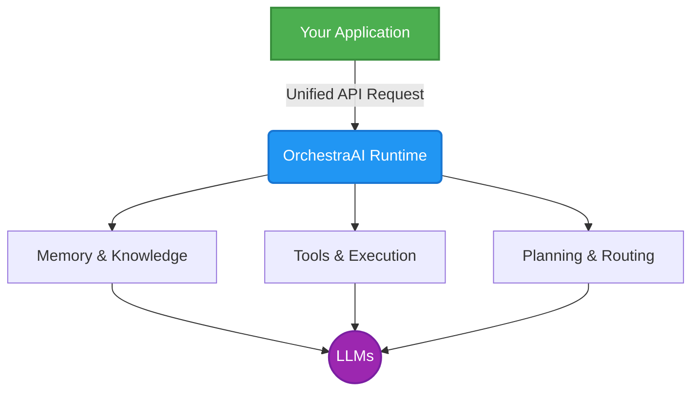
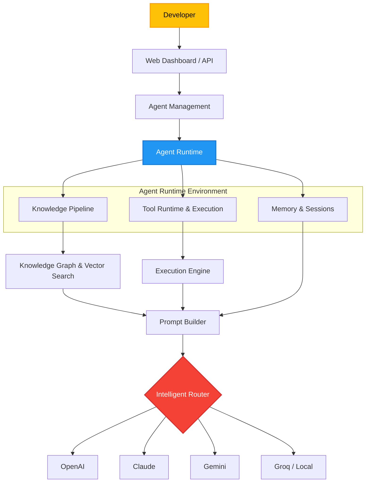

# OrchestraAI
### Build AI Agents. Not AI Infrastructure.

*A cloud-native AI Agent Runtime Platform that abstracts memory, knowledge, reasoning, tools, execution, and model orchestration behind a unified developer API.*

---

---

# ✨ Vision

While modern AI APIs expose powerful language models, developers are still burdened with building all the surrounding infrastructure. Developing a production-ready AI application typically requires custom implementations for memory, session management, information retrieval, and planning. Furthermore, developers must manage prompt construction, context limits, knowledge processing, tool orchestration, code execution, and model routing.

OrchestraAI aims to eliminate this complexity entirely. Instead of wasting time building backend AI infrastructure, developers should be able to focus purely on building their core applications. OrchestraAI acts as the intelligent runtime that powers every AI interaction seamlessly in the background.

---

# 💡 The Problem

In today's AI ecosystem, the gap between a simple LLM API call and a production-grade agent is vast. Developers spend weeks or months integrating memory systems, vector databases, and Retrieval-Augmented Generation (RAG) pipelines. They find themselves repeatedly solving the same problems: engineering prompts, managing tool calling, implementing session storage, and figuring out multi-model support. Adding advanced capabilities like autonomous planning, reflection, and context compression only multiplies the development time. As a result, the majority of effort is spent reinventing the wheel rather than innovating on the product.

---

# 🚀 Our Approach

OrchestraAI introduces a unified architecture where your applications communicate with just a single API. All underlying complexities are managed automatically by the runtime.

---

# 🧠 What Makes OrchestraAI Different

OrchestraAI is **not** another chatbot, LLM wrapper, simple RAG demo, or prompt library. 

Instead, it is a comprehensive **AI Runtime and Agent Infrastructure**. It serves as a unified knowledge platform, an execution engine, and a complete developer platform designed for scale.

---

# 🏗 Core Architecture

OrchestraAI provides a robust, multi-layered architecture to manage every aspect of the agent lifecycle.

---

# 🌍 Multi Provider Support

OrchestraAI offers seamless integration with multiple AI providers within a single workspace, including **OpenAI** (GPT-4o, GPT-4o-mini), **Anthropic** (Claude 3.5 Sonnet), **Google** (Gemini 1.5 Pro/Flash), **Groq** (Llama 3), and **Ollama** for local inference.

The runtime handles all provider-specific quirks automatically. It intelligently selects the best models for the task, rotates API keys securely, automatically retries failed requests, balances workloads, and optimizes costs—all without any changes to your application code.

---

# 📚 Knowledge Processing Pipeline

Uploading documents should never require developers to build and maintain a custom RAG pipeline. OrchestraAI supports a wide array of formats including **PDF, DOCX, Markdown, TXT, Websites, and API Documentation**.

Once a document is uploaded, the platform automates the entire ingestion process. It handles text extraction, optimal chunking, and embedding generation. It then performs entity detection to build a robust knowledge graph alongside a standard vector index. When queries are made, it uses hybrid retrieval to fetch the most relevant context and automatically optimizes the prompt before generating the final AI response.

---

# 🤖 Agent Isolation

Each developer or organization can host multiple, independent AI agents (e.g., a Support Agent, an HR Agent, a Coding Agent). 

Every single agent is strictly isolated. Each one securely owns its dedicated memory, session history, knowledge base, vector index, knowledge graph, API keys, tools, and execution policies. There is absolutely no shared state or cross-contamination between agents.

---

# 🔧 Developer Tools & Execution

Instead of dealing with raw database connections, developers expose specific operations as tools (e.g., *Search Orders*, *Create Invoice*, *Read CRM*, or *Internal APIs*). The runtime intelligently decides exactly when and how to invoke these operations.

### ⚡ Execution Runtime
The platform determines the safest and most efficient environment for work to execute. Whether it requires Cloud Python execution, a secured Cloud Terminal, a headless Browser, local runtime, or interacting with an external service, OrchestraAI routes it appropriately. In this paradigm, **the model focuses strictly on reasoning, while the runtime focuses entirely on execution.**

---

# 🎯 Goals & Planned Components

**Core Objectives:**
* Make AI development infrastructure-free and standardize production AI agents.
* Simplify enterprise AI adoption and reduce development complexity.
* Improve scalability and build reusable intelligent runtimes.

**Key Components:**
The platform consists of several micro-services including an Agent Runtime, API Gateway, Knowledge/Memory Services, Tool Runtime, Model Router, Execution Engine, Planner, Reflection Engine, Knowledge Graph, and a Developer SDK.

---

# 🛣 Roadmap

| Phase | Planned Features |
| :--- | :--- |
| **v1 (Current)** | Agent Management, Session Management, Knowledge Upload, Vector Search, Multi-Model APIs, REST API. |
| **v2** | Knowledge Graph, Hybrid Retrieval, Tool Runtime, Model Routing, Memory Engine. |
| **v3** | Autonomous Planner, Reflection capabilities, Distributed Execution, Complex Autonomous Workflows. |

---

# 🔥 Long Term Vision

We believe AI applications should not manage prompts, memory, retrieval, execution, or orchestration—just as modern applications do not manually manage CPU allocation, memory addressing, or networking inside an operating system. 

Instead, **applications should simply request intelligence, and the runtime handles everything else.**

---

# 📖 Philosophy

> Developers shouldn't build AI infrastructure.  
> They should build applications.

---

# ⚠ Current Status

This repository contains the **initial architecture and vision (v1.0)** of OrchestraAI. The project is currently under active research and development. Features described in this document represent the long-term roadmap and may be introduced incrementally.

---

# 🤝 Contributing

Contributions, architectural discussions, design reviews, and ideas are welcome.

 

### Building the future runtime for intelligent software.

⭐ Star the repository if you'd like to follow the journey.

